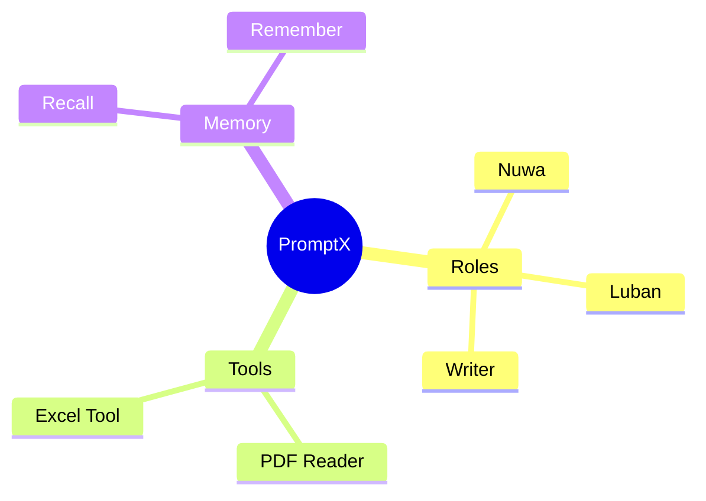

# Cognitive Memory

PromptX's cognitive memory system enables AI to remember, learn, and build knowledge over time. Unlike traditional AI that forgets everything after each conversation, PromptX creates a persistent memory network that grows richer with every interaction.

## What is Cognitive Memory?

Think of cognitive memory as AI's **long-term memory and knowledge graph**. Just like how humans remember experiences, concepts, and their relationships, PromptX stores memories in a semantic network where concepts connect and activate each other.

**Key Concept:**
```
Experience → Remember → Memory Network → Recall → Knowledge
```

Each AI role has its own memory network that accumulates knowledge and experience over time, making it smarter with every conversation.

---

## Core Concepts

### Engrams - Memory Traces

**Engram** (记忆痕迹) is the basic unit of memory in PromptX. It represents a single piece of knowledge or experience.

**Engram Structure:**
```javascript
{
  content: "The core experience or knowledge",
  schema: "keyword1 keyword2 keyword3",
  strength: 0.7,  // Memory strength (0-1)
  type: "ATOMIC",  // ATOMIC | LINK | PATTERN
  timestamp: 1234567890
}
```

**Three Types of Engrams:**

1. **ATOMIC** - Concrete concepts
   - Nouns, entities, specific facts
   - Example: "PromptX is an AI context platform"
   - Schema: "PromptX AI platform"

2. **LINK** - Relationships
   - Verbs, prepositions, connections
   - Example: "Roles use tools to perform tasks"
   - Schema: "roles tools tasks"

3. **PATTERN** - Structured knowledge
   - Processes, methodologies, frameworks
   - Example: "First analyze, then design, finally implement"
   - Schema: "analyze design implement"

###Network - Semantic Graph

The memory network is a **semantic graph** where concepts (nodes) connect with weighted edges based on co-occurrence in engrams.

**How It Works:**
```
Engram: "PromptX provides roles and tools"
         ↓
Creates nodes: [PromptX, roles, tools]
         ↓
Creates edges: PromptX ⟷ roles ⟷ tools
```

Over time, frequently connected concepts form stronger connections, creating a rich knowledge graph that reflects the role's expertise.

### Mind - Working Memory

**Mind** represents currently activated concepts during a recall operation. It's like AI's **working memory** - the subset of knowledge currently being "thought about."

**Mind Structure:**
```javascript
{
  center: "PromptX",           // Starting point
  activatedCues: ["PromptX", "roles", "tools", ...],
  connections: [
    {from: "PromptX", to: "roles", weight: 0.85},
    {from: "roles", to: "tools", weight: 0.72}
  ],
  engrams: [...]                // Retrieved memories
}
```

---

## The Cognitive Loop

PromptX's memory system follows a continuous learning cycle:

```
┌──────────────┐
│  New Task    │
└──────┬───────┘
       ↓
┌──────────────────────┐
│  DMN Scan Network    │ → recall(role, null)
│  See full landscape  │
└──────┬───────────────┘
       ↓
┌──────────────────────┐
│  Multi-round Recall  │ → recall keywords from network
│  Deep exploration    │
└──────┬───────────────┘
       ↓
┌──────────────────────┐
│  Answer with Memory  │ → Use retrieved knowledge
└──────┬───────────────┘
       ↓
┌──────────────────────┐
│  Remember New        │ → remember(role, engrams)
│  Save learnings      │
└──────────────────────┘
```

This loop ensures that AI continuously learns and improves from experience.

---

## Using Memory: Recall

**Recall** activates the memory network to retrieve relevant knowledge.

### Recommended Workflow

**Step 1: DMN Mode - Get the Full Picture**
```
User: Recall everything about PromptX
AI: [Uses recall with null query - DMN mode]
```

**What DMN Does:**
- Automatically selects hub nodes (most connected concepts)
- Returns network overview showing all memory domains
- Helps you discover what the role knows

**When to Use:**
- Starting a new task
- Exploring what knowledge exists
- Not sure what keywords to search

**Step 2: Targeted Recall - Deep Dive**

From the network map, pick relevant keywords and recall again:

```
User: Tell me about PromptX's role system
AI: [Recalls "roles" from the network]
    [Analyzes results and related concepts]
    [May recall "personalities" or "activation" for deeper understanding]
```

**Key Principle:** Multi-round exploration - don't stop after one recall!

### Recall Modes

**Balanced** (Default) - Balance precision and exploration
```
Recall with mode: balanced
```
Best for: Most situations, general knowledge retrieval

**Focused** - Precise search, prioritize frequently used memories
```
Recall with mode: focused
```
Best for: Finding specific facts, recent knowledge

**Creative** - Broad exploration, discover distant connections
```
Recall with mode: creative
```
Best for: Brainstorming, finding unexpected insights

### Example Conversation

```
User: What do you know about building AI tools?

AI: [DMN scan - views full memory network]
    I see knowledge about: ToolX, Luban, tool-creator, MCP...

    [Recalls "ToolX" - gets core concepts]
    [Recalls "tool-creator" - gets implementation details]
    [Recalls "Luban" - gets expert methodology]

    Based on my memory, here's what I know...
```

---

## Using Memory: Remember

**Remember** stores new knowledge into the memory network.

### When to Remember

Form a habit - remember whenever you learn something:

- ✅ After answering a question → Remember key points
- ✅ After solving a problem → Remember the solution
- ✅ Learning new knowledge → Remember to save it
- ✅ Discovering a pattern → Remember the methodology
- ✅ Recalling blank domains → **Must** remember to fill gaps

### Quick Remember Template

```javascript
{
  role: "current-role-id",
  engrams: [{
    content: "Core knowledge just discussed",
    schema: "keyword1 keyword2 keyword3",
    strength: 0.7,
    type: "ATOMIC"
  }]
}
```

**Tips:**
- Don't overthink - rough is fine
- Extract keywords from original text
- Default strength 0.7 works for most cases
- Choose type based on content nature

### Memory Strength Guidelines

- **0.9-1.0** - Critical, foundational knowledge
- **0.7-0.8** - Important, frequently used
- **0.5-0.6** - Useful, occasionally relevant
- **0.3-0.4** - Minor details, rarely needed

### Real Examples

**Simple Fact**
```javascript
{
  content: "PromptX desktop app runs on port 5203",
  schema: "PromptX desktop port 5203",
  strength: 0.8,
  type: "ATOMIC"
}
```

**Relationship**
```javascript
{
  content: "Roles activate through natural language",
  schema: "roles activate natural-language",
  strength: 0.7,
  type: "LINK"
}
```

**Process Pattern**
```javascript
{
  content: "Tool creation: design → implement → test → document",
  schema: "tool design implement test document",
  strength: 0.9,
  type: "PATTERN"
}
```

### Why Build the Remember Habit

✅ **Avoid repeating research** - Next time, recall gives instant answers
✅ **Network grows richer** - More connections, smarter AI
✅ **Accumulated expertise** - Role becomes true domain expert
❌ **No remember = Always starting from zero**

**Remember:** Every remember is an investment in your AI's future capabilities!

---

## How Memory Works

### Two-Phase Recall Strategy

PromptX uses a sophisticated two-phase approach for efficient memory retrieval:

**Phase 1: Coarse Recall**
- Activation spreading from query keywords
- Rapid candidate set generation
- Loads all related engrams (up to 100 nodes)

**Phase 2: Fine Ranking**
- Composite weight calculation
- Type-based prioritization
- Quota-based selection

**Weight Factors:**
```javascript
{
  type: 0.3,        // Type weight (PATTERN > LINK > ATOMIC)
  relevance: 0.4,   // Relevance to query
  strength: 0.2,    // Memory strength
  temporal: 0.1     // Recency
}
```

**Type Quotas:**
```javascript
{
  PATTERN: 10,   // Up to 10 pattern memories
  LINK: 15,      // Up to 15 relationship memories
  ATOMIC: 25     // Up to 25 atomic facts
}
```

This ensures a balanced mix of different knowledge types in recall results.

### Spreading Activation

Memory recall uses **spreading activation** - a cognitive science principle where activation flows through connected concepts.

```
Start: "PromptX"
  ↓
Activate: roles, tools, memory (direct connections)
  ↓
Spread to: Nuwa, Luban, recall, remember (indirect connections)
  ↓
Form Mind: Complete activated subgraph
```

**Key Properties:**
- **Energy-based** - Activation decays as it spreads
- **Weighted** - Stronger connections spread more activation
- **Depth-limited** - Prevents runaway activation
- **Frequency-aware** - Frequently recalled nodes have advantage

### Memory Persistence

All memory data is stored in SQLite databases:

**Location:**
- System memories: `~/.promptx/system/cognition/`
- User memories: `~/.promptx/user/cognition/`
- Project memories: `{project}/.promptx/resource/cognition/`

**Storage Structure:**
```
cognition/
├── {role-id}.json        # Network structure (nodes & edges)
└── engrams.db            # Engram content (SQLite)
```

**Benefits:**
- Fast queries with SQL indexing
- Efficient memory usage
- Easy backup and versioning
- Cross-session persistence

---

## Memory for Each Role

Each AI role has its **own independent memory network**:

### System Roles

**Nuwa** (Role Creator)
- Remembers: Role design patterns, DPML structures, personality traits
- Recalls: Previous role creations, design principles, user preferences

**Luban** (Tool Integration Master)
- Remembers: API patterns, tool configurations, integration approaches
- Recalls: Previous integrations, common issues, best practices

**Writer** (Content Creator)
- Remembers: Writing style preferences, brand voice, content patterns
- Recalls: Previous articles, tone guidelines, successful formats

**Sean** (Product Decision Maker)
- Remembers: Product strategies, decision frameworks, market insights
- Recalls: Past decisions, user feedback, strategic priorities

### Custom Roles

When you create custom roles with Nuwa, they start with empty memory networks and build knowledge through use.

**Example: DevOps Expert Role**
```
Initial state: Empty network

After conversations:
- Remembers your infrastructure (AWS regions, services)
- Recalls your deployment patterns
- Learns your security preferences
- Builds DevOps methodology knowledge
```

---

## Memory Best Practices

### For Users

**1. Start with DMN Mode**
```
"Show me what you know about X"
(AI uses recall with null query)
```

**2. Be Specific in Follow-ups**
```
"Tell me more about [keyword from network map]"
```

**3. Correct and Teach**
```
"Actually, our process is different. Remember that..."
```

**4. Build Domain Knowledge Gradually**
- Have conversations about your domain
- AI will remember key concepts
- Over time, creates comprehensive knowledge base

### For AI Roles

**1. Always DMN First**
- See full network landscape
- Avoid guessing keywords
- Discover all relevant memory domains

**2. Multi-Round Deep Dive**
- Don't stop after one recall
- Follow connections to related concepts
- Explore until information is sufficient

**3. Remember After Every Task**
- At least one remember per conversation
- Focus on quality over quantity
- Fill gaps in memory network

**4. Occam's Razor for Memory Content**
- Remove unnecessary words
- Keep only essential meaning
- "If it doesn't change meaning, remove it"

---

## Advanced Topics

### Memory Network Analysis

**Hub Nodes** - Most connected concepts
```
User: What are your core knowledge areas?
AI: [Analyzes network hubs]
    My strongest knowledge domains are...
```

**Memory Statistics**
- Total concepts stored
- Average connections per concept
- Most frequently recalled memories
- Knowledge growth over time

### Memory Visualization

Memory networks can be visualized as **mind maps**:



### Memory Maintenance

**Network Health:**
- Monitor orphaned nodes (concepts with no connections)
- Check memory distribution (balanced across types)
- Review recall frequency patterns

**Memory Cleanup:**
- Remove outdated information
- Merge duplicate concepts
- Strengthen important connections

---

## Troubleshooting

### Recall Returns Nothing

**Possible causes:**
- Network is empty (new role)
- Query keywords don't exist in network
- Network not loaded properly

**Solutions:**
1. Use DMN mode to see what exists
2. Remember some initial knowledge
3. Check role activation

### Remember Doesn't Work

**Possible causes:**
- Invalid engram structure
- Schema too short (less than 2 keywords)
- Strength out of range (must be 0-1)

**Solutions:**
1. Check engram format
2. Ensure at least 2 keywords in schema
3. Verify strength value

### Memory Not Persisting

**Possible causes:**
- File permissions issue
- Disk space full
- Network not saved after remember

**Solutions:**
1. Check `~/.promptx/` permissions
2. Verify disk space
3. System saves automatically after remember

---

## What's Next?

- **[AI Roles](/docs/roles)** - Learn how roles use memory systems
- **[ToolX Runtime](/docs/toolx)** - Understand role tools and capabilities
- **[Quick Start](/docs/quick-start)** - Get started with PromptX

---

**The power of memory:** AI that learns from every conversation and becomes smarter over time.

Need help? Join our [Discord community](https://discord.gg/rdmPr54K) or check the [GitHub Issues](https://github.com/Deepractice/PromptX/issues).
